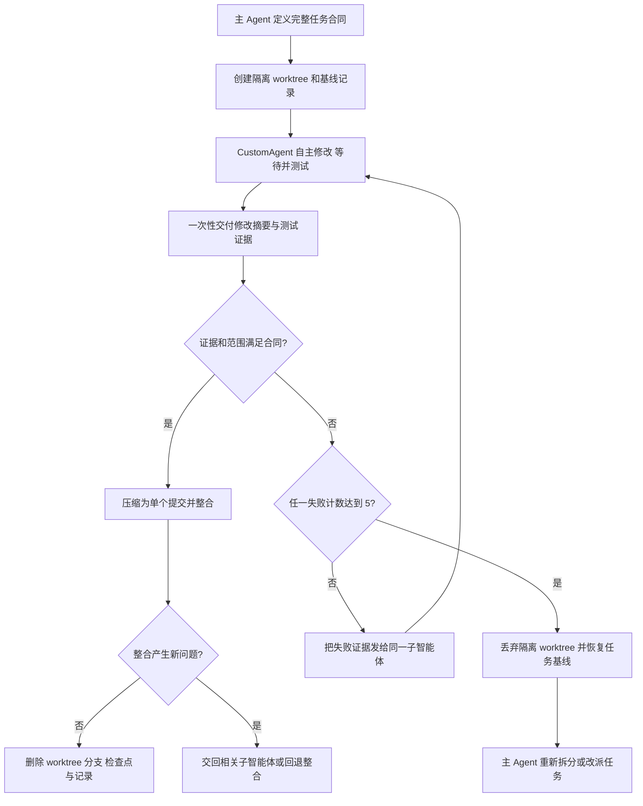

# 隔离写入工作流

主 Agent 不把活动检出直接交给可写子智能体。每个独立任务使用一个临时 worktree、一个任务分支和一个 Git 公共目录中的临时 manifest。



## 完整任务合同

主 Agent 每次派发都要一次性提供足够信息，让子智能体不依赖逐步追问即可完成工作：

- 最终要交付的行为、文件或可验证结果。
- 当前代码、输入材料、参考实现和绝对 worktree 路径。
- 明确的允许修改路径，以及其他代理正在修改或禁止触碰的范围。
- 必须运行的测试、静态检查、构建或人工验证标准。
- 交付时需要返回的修改摘要、测试结果和剩余风险。
- 通信约束：自行选择具体实现、自行运行命令并等待结果；除实际阻塞、需要决定或影响其他任务外，中途不汇报。

主 Agent 不把具体实现拆成连续的小指令。任务范围或验收标准没有变化时，后续修订继续交给同一子智能体，以复用它已建立的代码上下文。只有需要无上下文偏见的独立审查时才新建子智能体。

## 等待与交付

- 主 Agent 不为普通进度主动发消息，不要求子智能体逐步汇报，也不回应无信息量的状态消息。
- 等待采用 `1 -> 2 -> 4 -> 8 -> 16` 分钟退避，之后维持 16 分钟；等待期间优先准备其他任务的合同、依赖和集成条件。
- 子智能体只在完成、实际阻塞、必须取得决定或发现会影响其他任务的冲突时发消息。
- 收到交付后，主 Agent 以测试证据为准，不重复执行子智能体已经成功运行的命令，不重新逐文件检查或计算全量哈希。
- 主 Agent 只处理范围合规、任务间依赖和集成后新出现的问题。独立审查若确有需要，交给新的子智能体。

## 命令顺序

任务开始前，主工作区必须干净。`--summary` 与 `--acceptance` 只保存完成恢复所需的脱敏摘要，不保存 API Key 或无关完整对话。

```text
python3 scripts/task_worktree.py start --repo <repo> --task-id <id> --summary <summary> --acceptance <criteria> --path <scope> --json
```

把输出的绝对 `worktree` 路径和 `write_scopes` 交给 `CustomAgent`。每轮修改和验收后记录检查点：

```text
python3 scripts/task_worktree.py checkpoint --repo <repo> --task-id <id> --attempt <n> --note <feedback> --evidence <test-result> [--attempt-failed] [--parent-redirect] [--review-rejected] --json
```

验收证据满足任务合同时直接整合。只有整合改变了环境、出现冲突或暴露新失败时，才运行针对该新问题的检查；不要重跑子智能体已经成功执行的完整测试：

```text
python3 scripts/task_worktree.py integrate --repo <repo> --task-id <id> --evidence <accepted-test> --json
python3 scripts/task_worktree.py finalize --repo <repo> --task-id <id> --json
```

整合出现新失败时，优先把证据交回原子智能体处理。需要回退时，只有主分支仍停留在该整合提交且工作区干净才允许自动 revert：

```text
python3 scripts/task_worktree.py rollback-integrated --repo <repo> --task-id <id> --json
```

第五次失败或主动终止时，主 Agent 运行 `abort`。该命令强制删除隔离 worktree 和任务分支，不修改主工作区，然后清理 manifest 与检查点。主 Agent 随后重新拆分、补充合同或改派任务，不直接接手实现：

```text
python3 scripts/task_worktree.py abort --repo <repo> --task-id <id> --json
```

## 安全不变量

- `start` 拒绝不干净的主工作区，不会自动 stash、提交、reset 或删除用户修改。
- 子智能体只能修改声明的写入范围。最终树存在越界文件时，`integrate` 拒绝执行。
- `integrate` 要求主工作区仍处于任务基线且干净，防止覆盖并发修改。
- 每次整合在主分支上只产生一个提交。中间失败版本只存在于临时任务分支。
- `finalize`、`abort` 和 `rollback-integrated` 完成后删除临时 worktree、任务分支、检查点和记录。
